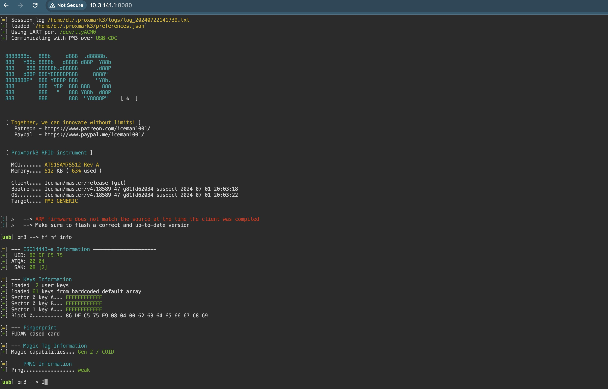
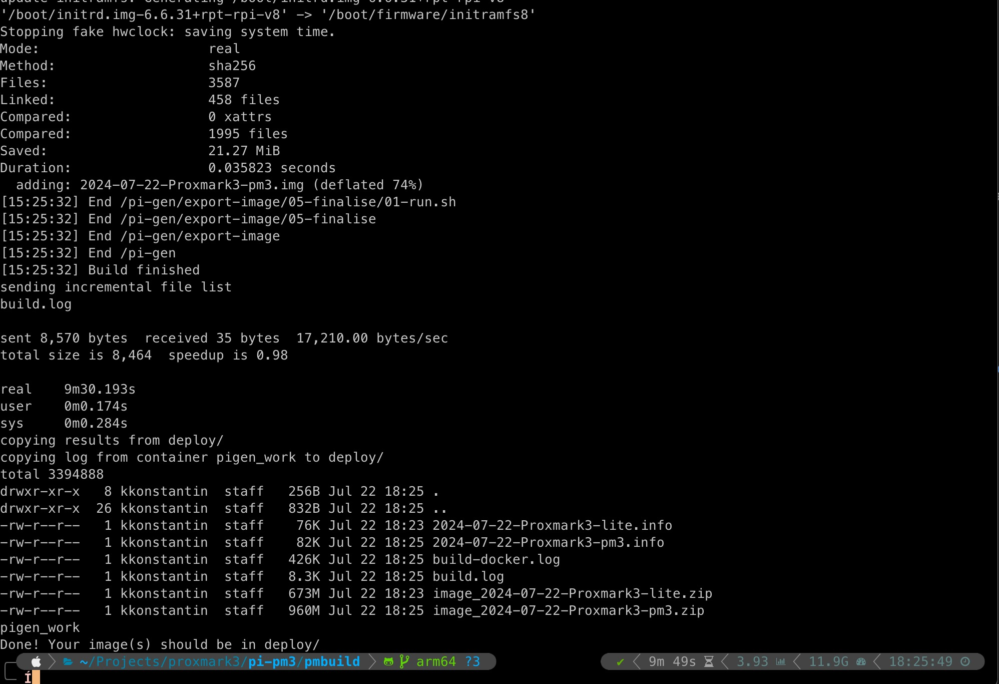

# Proxmark3 Raspberry Pi Zero 2 W

This image is configured to set up a wifio access point, and SSH.   
It will expose a web shell on port 8000 and a pm3 shell on port 8050.    
The default user credentials are - username: `dt` password: `proxmark3`

## AP management interface
Management interface: http://10.3.141.1/

```
IP address: 10.3.141.1
Username: admin
Password: secret
DHCP range: 10.3.141.50 — 10.3.141.254
SSID: raspi-webgui
Password: ChangeMe
```
## web shell
* web shell (u: dt ; p: proxmark3) at http://10.3.141.1:8000/

## web pm3 console
* pm3 shell (u: dt ; p: proxmark3) at http://10.3.141.1:8080/


## usage
You can burn the image to a sd-card using https://etcher.balena.io/   
Insert the sd-card in your RPI Zero 2 w and power it on.   
Wait for one minute for the OS to boot and then connect to the Access Point using the following credentials
```
SSID: raspi-webgui
Password: ChangeMe
```

## build

To build new image you need will have to follow the steps below:
(Tested only on Mac Arm64 arch)

1. checkout pi-gen  
    ``` git clone https://github.com/RPi-Distro/pi-gen.git pmbuild ```
2. copy the content of pi-pm3 folder to pmbuild  
    ``` cp -rp pi-gen pmbuild/ ```
3. Checkout the arm64 branch of pi-gen  
    ``` cd pmbuild; git checkout arm64 ```
4. make sure you have a docker server running (or any of it's alternatives https://spacelift.io/blog/docker-alternatives)
5. start the build in a docker container   
   ``` ./docker-build.sh ```

On a successful build uou should get something like the screenshot blow:
        